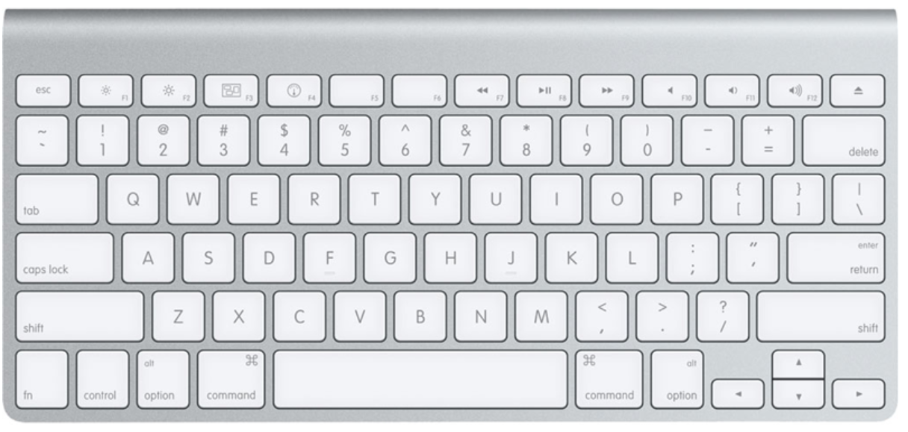
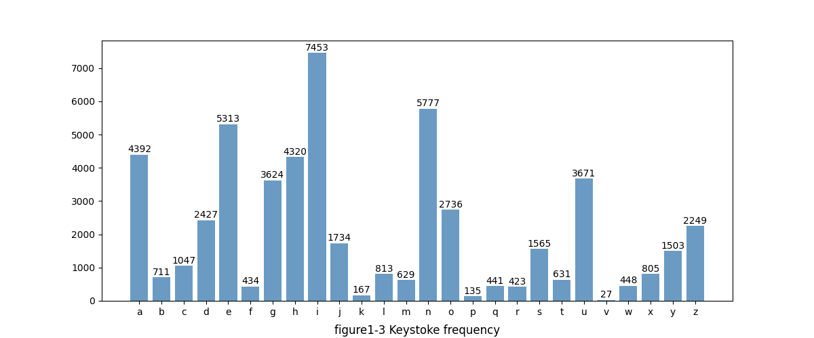
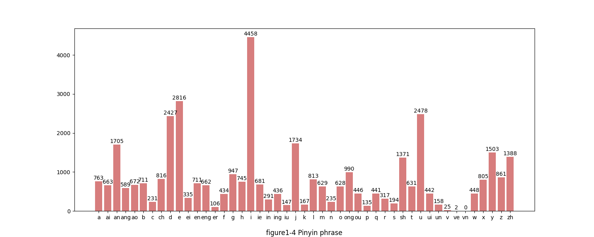
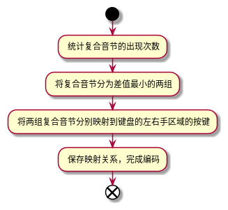
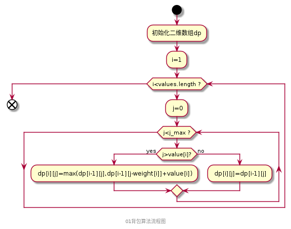
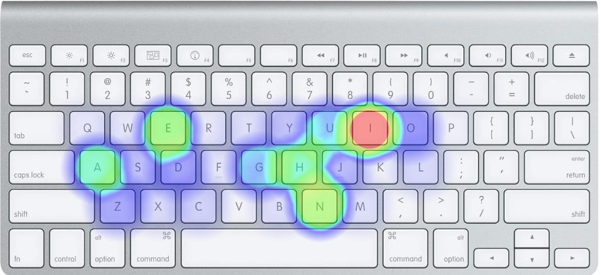
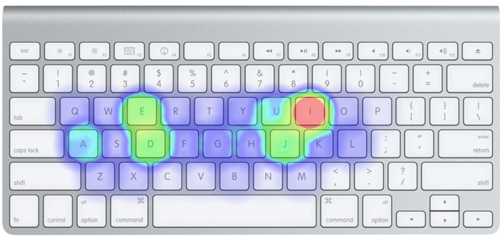
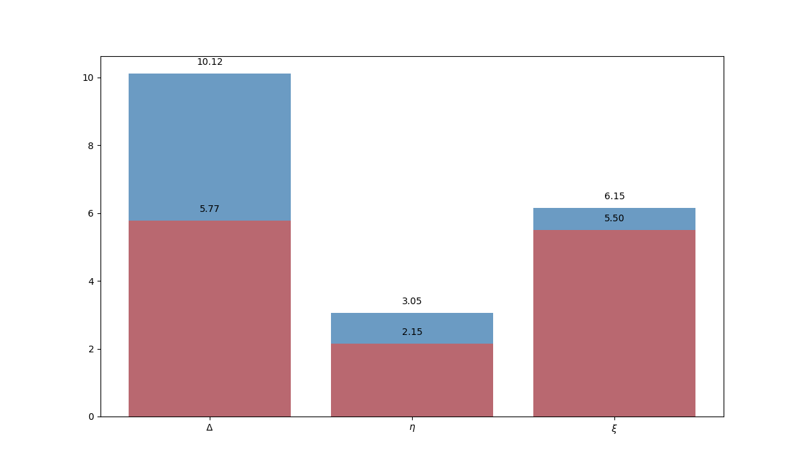

[问题答案在实验结果](#1)
---
# 高效均匀的打字编码方法

### 一、问题背景

1. **问题描述**
```
题目：高效均匀的打字编码方法
由于不同汉字的使用频率和输入方式不同，使用全拼输入法撰写文章时，26个字母键盘的使用频率并不均衡。
假设给定一篇中文文章素材（附件文章），使用全拼输入法（不考虑词组缩写）输入这篇文章中的文字。
请你评价使用全拼时26字母按键的均衡性和输入效率，并尝试设计一种新的拼写编码方法，使得输入同样文章时按键使用更加均衡、输入更加高效。

具体要求：
1. 给定一篇中文文章（附件中的文章），统计出使用全拼输入法录入这篇文章时26个字母键的使用频率，绘制热力图。
- 输入: 一篇中文文章（附件文章）
- 输出: 录入这篇文章的26字母键使用热力图

2. 设计评价标准来分别评价使用全拼录入这篇文章时的按键使用均衡性和输入效率（请根据个人理解自行定义，建议使用明确的量化指标）。 
- 输出: 量化评价标准或方法，以及对全拼输入方案的评价结果

3. 基于你在题目2中制定的标准，尝试在全拼基础上改进打字编码方案，使得输入该文章时字母键的使用更加均衡、输入更加高效，展示改进的结果并分析。
- 输入: 一篇中文文章（附件文章）
- 输出: 新的打字编码方案、新旧方案在均衡性和输入效率方面的对比
```
2. **问题背景分析**<br />
   **1）拼音结构**

   &emsp;全拼输入法，即输入汉字的完成拼音的输入方式，它高度依赖拼音的结构。拼音（除整体认读音节外）的构造由声母、韵母和声调三部分组成，而输入法中通常忽略声调，采用 $[\$shengmu][\$yunmu]$ 的编码方案。声母仅有3个由多个字符组成的复合声母（zh、ch、sh）；而韵母有5个单韵母和18个复合韵母，复合韵母由多个字符组成，输入时的击键耗时太多，存在优化的空间。
   **2）按键位置**
   &emsp;按键的位置对击键速度和击键错误率存在较大的影响（击键速度：中排>上排>下排； 错误率： 下排>上排>中排）。如图 *1-2* 所示，键盘的字母区总共占了三排，打字时我们的手指放在字母区的第二排，在敲击时不需要二次移动，故第二排的字母具有更快的击键速度和更低的错误率；第一排（上排）同第三排（下排)相比，它在输入者的可视角度范围内，并且在打字时伸指比屈指更容易，故第一排的输入速度和错误率仅次于第二排；第三排由于手指遮挡和屈指的的影响，输入速度和错误率均落后于前两排。
   <br />
    
    <br />
   **3）文章分析**

    &emsp;分别统计全拼编码的每个按键的敲击次数和每个声母韵母的出现次数。使用 $xpinyin$ 模块把汉字转化为对应的拼音，对汉字的拼音逐个统计和分析。<br />
    
    &emsp;如图 1-3所示，全拼输入法将大量的输入任务集中在某些字母键（i,a,e,n等）上，输入任务的过度集中会导致某些手指的负载过重从而导致疲惫，直接影响文字的输入效率。<br >
    
    &emsp;如图 1-4所示，按照拼音声母韵母的字符组合进行统计，某些字符（i,a,e,n）击键频率骤减，即引起全拼输入时字符高度集中的原因是**复合字符的编码集中在少数字符上（i,a,e,n,h等）**，对复合字符进行重新编码是解决按键使用不均衡的重要方式。

### 二、建模分析
1. **量化指标**

   **1）均衡性**

   &emsp;均衡性,即键盘按键的使用频率相对的平均，结合键盘区域性的差异，应尽可能让击键数在第二排均匀分布。按键的使用均衡意味着，每个手指的负载更加平均，避免局部手指疲惫导致输入效率降低。设 $\Delta$ 为按键点击次数的方差， 当 $\Delta$ 的值越大，按键击键数的差别越小，按键的的使用频率越均衡；反之，按键的击键数差别越大， 按键的使用频率局部集中。因此，用 $\Delta$ 作为均衡性的指标。
$$ \Delta = \sqrt[2]{\sum_{i=1}^{26} (num_i - \overline{num})} $$
   &emsp;$\Delta$ 表示击键数的方差，$num_i$ 表示第 $i$ 个字符的击键数，$ \overline{num} $ 表示击键数的算数平均。
   &emsp;键盘不同区域的按键的击键速度和错误率存在较明显的差异，为了提高输入效率，应尽可能让击键数分布在第二排（中排）和第一排（上排）的按键区域，欧拉公式直接计算方差忽略了不同区域按键的差异，故用其作为均衡指标存在较大误差。为了准确描述均衡性指标，可给予键盘区域 $i$ 权重 $weight_i$, 因此均衡性指标可表示为：

   $$ \Delta = \sqrt[2]{\sum_{i=1}^{26} weight_i(num_i - \overline{num})}  $$ 
   &emsp; $weight_i$ 表示按键 $i$ 的权重。
    <br />

   **2）效率指标**

   &emsp;输入效率（$\eta$）由输入字符的速度决定，而输入速度由输入者对输入法的熟悉度、对键盘的熟悉度、输入的击键数共同决定。去除主观因素的影响，**假设用户对两种输入法（全拼和全拼改进）同等熟悉**，输入者对键盘的熟悉程度表现为输入错误率 $\xi$ ，$\xi$ 受按键区域的影响，第二排和第一排的错误率均低于第三排，故用 $\xi_i$ 表示按键 $i$ 的错误率，按键 $i$ 的击键数由 $num_i$ 表示。由于错误率 $\xi_i$ 的存在, 按键 $i$ 的实际击键数 $a\_num_i$ 会大于 $num_i$，即：
   $$ a\_num_i=num_i*(1+2*\xi_i)$$
    &emsp;当字符输入出错时，需要退格（$backspace$）重新输入，每输错一个字符需要额外击键两次，故得到上述公式。
    &emsp;将每个按键 $i$ 的实际击键数累加，得到总的击键数：
    $$ a\_sum=\sum_{i=1}^{26}a\_num_i= \sum_{i=1}^{26}num_i*(1+2*\xi_i)$$
    &emsp; $ a\_sum $ 表示实际击键数之和。由于输入文本的长度($length$)不同，故用平均击键数来衡量输入效率 $\eta$ ：
    $$ \eta = a\_num/length $$

   **3）评价方案**

    &emsp; 用 $\overline{\xi} $ 表示输入整篇文章的错误率， 等于 输入出错的次数/实际击键数。
    $$ \overline{\xi} =\frac{(a\_sum-\sum_{i-1}^{26}num_i)/2}{a\_sum}= \frac{1}{2}-\frac{\sum_{i=1}^{26}num_i}{a\_sum} $$
    &emsp; 将均衡指标（$\Delta$）、效率指标（$\eta$）和输入错误率（$\overline{\xi}$）分别按照权重 $ \alpha\ ,\beta\ \gamma$ 分别表示相加得到综合评价指标 $\Theta$ 。
    $$ \Theta = \alpha*\Delta + \beta*\eta+\gamma*\overline{\xi} $$
    &emsp;综合评价指标 $ \Theta $ 越小，即按键分布更均衡，按键的平均输入字符越短，输入越快，输入的错误率越低，故 $\Theta$ 越低，编码方案的性能越好。

2. **编码方案**

    &emsp;全拼编码的方案要求同时输入者输入完整的音节，它能做到无歧义的拼写，但是这样也导致击键数多和击键范围集中。究其原因，是拼音中复合音节的组合由**多个单字符组成且选择单字符的范围高度集中**。
    **1）改进方案**

   + &emsp;保留全拼单个字符的表示方式，尽可能保留用户的输入习惯。
   + &emsp;对拼音的复合音节重新编码，用 *；{$character}* 的格式表示复合音节。 *character* 表示单个字符，*；* 表示转义符。
   + &emsp;优先使用输入效率高的按键区域的字符，由于不同键盘区域输入效率存在较大差别，故编码时应该尽可能的让*character*均匀分布在第二排和第一排。
   + &emsp;当需要输入分号 *；* ，使用 *;;* 转义表示。

3. **可行性研究**

    **1）描述无歧义**

    &emsp;编码方案的一条重要原则时无歧义，定义模糊或则存在歧义都会给用户使用带来困难。上述的编码方案，拼音一共存在21个复合音节，而键盘字母区共有26个字符，用 转义符+字符 来定义复合音节的编码不存在重复，故不存在歧义。

    **2）高效率**

    &emsp;上述编码方案既减少了字符长度，又提高了字符的输入速度。首先是选中 *“；”* 作为转义字符，通常情况下右手小拇指放在 *;* 按键吗，且小拇指的负载很轻，仅负责右手的符号输入，*“；”* 的击键速度要远快于其他按键，它的输入时间约是其他按键的 $\frac{1}{2}$ 。其次，3个字符组成的音节编码后是2个字符，减少了编码的长度。最后，将高频出现的复合音节编码到输入效率高的键盘区域，整体的输入效率进一步提高。

    **3）均衡算法设计**

    &emsp; 让击键尽可能均匀分布输入效率高的区域是编码方案的重要原则。因此，需要设计一个算法使键盘左右区域尽可能均衡分布。

    &emsp; **问题描述**： 键盘的字母区分为 *left* 和 *right* 区域，在拼音中共有21个复合音节，需要用 *; + charecter* 的格式将复合音节映射到 *；[a-z]* 的范围内，并且要求 *left* 和 *rgiht* 的击键次数相差最小。 提供的数据：
     
    ```
        phrase_frequency: map类型，存储着复合音节及其出现的次数。
        difference: int, 单字符音节在键盘左右区域击键的差值。
    ```

    &emsp; **问题分析**： 对上述问题进行分析， 即将复合音节分为两个部分，并且是这两部分的差距要尽可能小。如果分割生成的两个数组 A 和 B 的值相差最小，即数组A或B的和离A和B的平均值最近，那么问题可以抽象为冲一个数组中选取一组数，在不大于平均值的情况下使数组的值最大，即01背包模型，整体的流程图如下所示：
    
    &emsp; **设计分组算法**：用$dp[i][j]$ 表示表示从下标为[0-i]的音节里任意取，放进容量为j的数组中，击键数总和最大是多少，当音节 $i$ 在数组中时, <br />
    $$dp[i][j]=dp[i-1][j-phrase\_frequency[i]]+phrase\_frequency[i]$$
    当音节 $i$ 不在数组中时，
    $$dp[i][j]=dp[i-1][j]$$
    由此可得递推公式：
    $$dp[i][j]=max(dp[i-1][j],dp[i-1][j-phrase\_frequency[i]]+phrase\_frequency[i]$$

    &emsp;根据上述描述画出01背包的流程图如下：
    
    &emsp;由上述算法可以将音节分为差值最相近的两组，用一个伴随矩阵 $path[i][j]$ 记录是否选取音节 $i$ ，从后向前进行回溯就能得到具体的分组。

    &emsp; **确定编码方案**：分别对键盘左部区域和右部区域的按键按照击键的难易程序排序，按照难度从低到高依次匹配击键数从高到低的音节，即音节的点击数越高，匹配的按键越容易点击。得到如下编码:

    音节|编码|音节|编码|
    --|--|--|--|--
    <div style="width: 100pt">an|<div style="width: 100pt">;a|<div style="width: 100pt">ong|<div style="width: 100pt">;f|
    ch|;d|en|;g|
    ie|;s|ao|;e|
    eng|;r|ang|;q|
    ou|;w|ei|;v|
    iu|;t|zh|;j|
    sh|;k|ai|;h|
    ui|;i|ing|;l|
    in|;o|un|;p|
    er|;b|ve|;u|
    vn|;y|


<h3 id="1"> 三、实验结果 </h3>

1. **全拼热力图**
    &emsp;对全拼编码每个字符的击键数进行统计，得到如下结果
    字母|击键数|字母|击键数|字母|击键数|
    --|--|--|--|--|--|--|
    <div style="width: 70pt">a|<div style="width: 70pt">4392|<div style="width: 70pt">b|<div style="width: 70pt">711|<div style="width: 70pt">c|<div style="width: 70pt">1047|<div style="width: 70pt">d|<div style="width: 70pt">2427|
    e|5313|f|434|g|3624|h|4320|
    i|7453|j|1734|k|167|l|813|
    m|629|n|5777|o|2736|p|135|
    q|441|r|423|s|1565|t|631|
    u|3671|v|27|w|448|x|805|
    y|1503|z|2249|

    &emsp;根据上述数据，可以画出热力图如下：
    <br />
    
    <br >
    &emsp;由上图可以看出，字符集中在i,n,h,a,e五个按键上，这会让部分手指造成负载过大从而导致效率降低。

2. **全拼方案评价**
    &emsp;根据收集的数据分别计算全拼编码的均衡指标（$\Delta$）、输入效率指标（$\eta$）和 整体错误率（$\overline{\xi}$）,得到如下结果：
    均衡指标（$\Delta$)|输入效率指标（$\eta$）|整体错误率（$\overline{\xi}$）%
    --|--|--
    10.12<div style="width: 120pt">|<div style="width: 120pt">3.07|<div style="width: 120pt">6
    &emsp;当$ \alpha=0.4, \beta=0.5, \gamma=0.1 $ 时，由公式 $ \Theta = \alpha*\Delta + \beta*\eta+\gamma*\overline{\xi} $ 计算可得：
    $$ \Theta=0.4*10.12+0.5*3.07+0.1*6=6.138 $$

    &emsp; 由上述指标可见，均衡指标过大，说明按键的使用频率不均衡，在局部区域过于集中；输入效率指标较大，则输入单个函数所需敲击的按键多，耗时长；整体错误率适中。综上所述，全拼编码是一套无歧义，输入错误率较低的编码方式，但是他的输入单个汉字需要的字符过多，且按键的使用率过于集中，这是导致全拼编码使用效率低的原因。
3. **新旧编码对比**
    &emsp;改用用新的编码方式，统计每个按键的点击数并重新生成热力图：
    <br />
    
    <br />
    &emsp;对比两种编码方式的热力图，改进后的编码的按键使用集中在第二排和第一排，即分布在输入效率较高的区域；且按键使用率同全拼对比更加分散，即按键的分布更加均衡。
    &emsp;重新统计新编码的输入数据，并计算出评价指标值如下：
    均衡指标（$\Delta$)|输入效率指标（$\eta$）|整体错误率（$\overline{\xi}$）%
    --|--|--
    5.77<div style="width: 120pt">|<div style="width: 120pt">2.15|<div style="width: 120pt">5.50

    &emsp;同全拼编码的指标对比，可得到下图：

    
    <br />
    &emsp;由上图可知，双拼编码方案的均衡指标 $\Delta$ 下降近50%，表明双拼编码方案的按键使用率更为均衡；输入指标效率下降30%，表明双拼编码的每个汉字平均输入长度变短，输入时间变短，输入效率提高；整体的输入错误率略微下降，表明双拼编码的可靠性高。因此，**在输入者对两种编码方案同等熟悉的情况下，双拼方案具有更高的输入效率，键盘使用更均衡且具有高可靠性。**

### 四、总结和改进
1. **优缺点分析**<br />
    **1）优点**： 双拼编码减少汉字的平均码长，并且将多音节编码按照使用频率映射到敲击更加容易的区域，使其输入速度大幅提升，按键的使用率也更加均衡，使用的输入体验更好；同时，双拼输入法是基于全拼输入法改进而成，保留了全拼输入法的大部分使用习惯，便于用户学习和使用。<br />
    **2）缺点**： 第一，双拼输入法对复合音节的映射基于均衡算法完成的，而均衡算法着重于让按键的使用率更平衡，忽略了双拼编码和映射的复合音节间的相关性，即双拼编码和复合音节在逻辑上缺乏联系，因此对初学者不友好。第二，由双拼的热力图可以看出，即使对复合音节进行映射后，字母 $i$ 仍然拥有非常高的点击率，经过分析发现，在拼音中还有一个组成成分**介音**，而 $i$ 是介音的重要组成部分，故字母 $i$ 仍然具有非常高的点击率。<br />
2. **改进方案和可行性研究**<br />
    **1）优化介音的编码**<br />
    &emsp;**优化方案**： 对存在介音（i）且是后鼻韵(ang,eng,ong)的韵母，均忽略介音按照后鼻韵编码，如：
    <br />
    拼音|改进前|改进后(忽略介音 $i$ )|
    --|--|--|
    qiang<div style="width: 120pt">|qi;q<div style="width: 120pt">|q;q<div style="width: 120pt">|
    xiang|xi;q|x;q|
    &emsp;**可行性分析**：进一步研究含介音结构的拼音，发现对同一个声母而言，（介音 $i$ + 后鼻韵）和（无介音 + 后鼻韵）不共存,如下表所示。
    声母|介音 $i$ + 后鼻韵|无介音 + 后鼻韵
    --|--|--
    b <div style="width: 120pt">|n <div style="width: 120pt">|y <div style="width: 120pt">|
    c|n|y|
    d|n|y|
    f|n|y|
    g|n|y|
    h|n|y|
    j|y|n|
    k|n|y|
    m|n|y|
    p|n|y|
    q|y|n|
    r|n|y|
    s|n|y|
    t|n|y|
    w|n|y|
    x|y|n|
    z|n|y|
    sh|n|y|
    zh|n|y|
    ch|n|y|

    &emsp;由于两种组合韵母无法共存，因此不存在歧义，忽略介音能够减少汉字平均编码长度和减少字母 $i$ 的点击率。 
    <br/>

    **2）汉字词组编码**
    &emsp;**优化方案**：统计互联网言论发表比较多的区域（知乎，微博，豆瓣，B站等），用爬虫爬取用户言论，统计出现频率高的汉字词语组合，对频率出现高的词语进行按照汉字拼音的首字母缩写编码(如：但是->ds）。
    &emsp;**可行性研究**：首先，爬虫可以从互联网上收集大量的言论数据，从数据中统计出常用词汇的出现频率，B站统计了2020年度最热网络用词是“爷青回”，表明统计词汇频率具有可行性；其次，用拼音首字母简写代词词汇组合，符合输入者的使用习惯，是一种能够快速推广的方式。